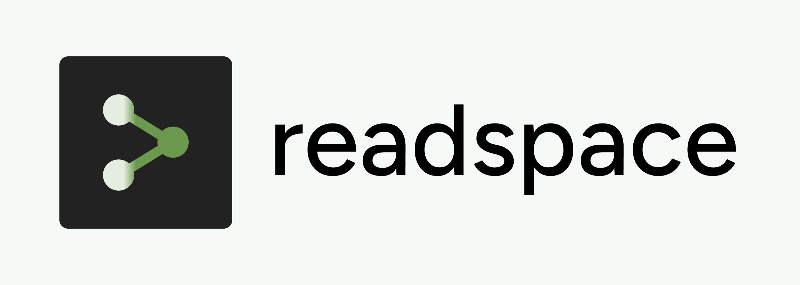
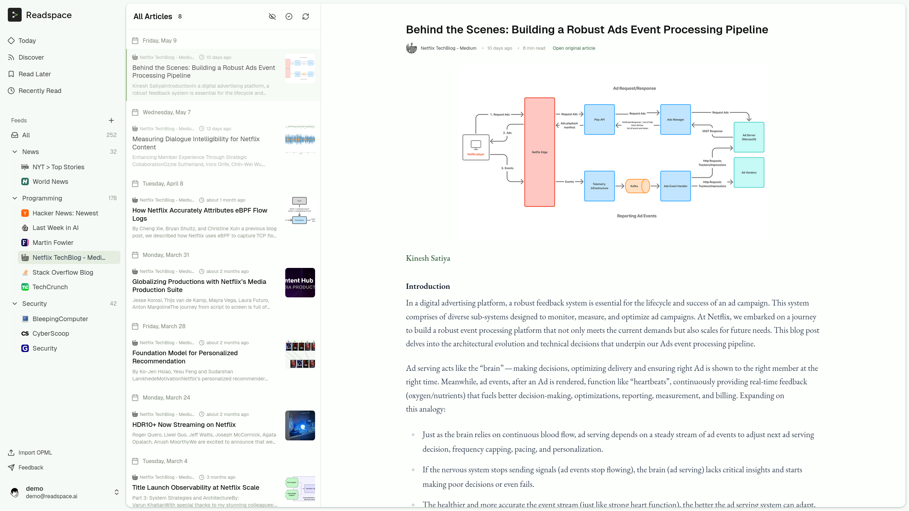

<div align="center">
  
</div>


# Readspace


**Tired of digital noise? Readspace brings all your content into one clean, distraction-free inbox.**

All in one beautiful, modern UI, designed for focused reading.



---

## What is Readspace?

Readspace is an **open-source, privacy-first reading hub** that brings all your favorite content into one clean, distraction-free inbox—**no ads, algorithms, or trackers**.

* **Unified Inbox:** News feeds, your favorite blogs, saved articles, subreddits, all in one place.
* **Chronological & Clean:** Feeds are delivered in order; you decide what stays and what goes.
* **Privacy & Ownership:** Fully self-hostable, zero third‑party tracking, your data stays with you.
* **Calm & Curated:** Leverage AI-powered summaries and noise filtering so you only see what matters, letting you focus on reading without overwhelm.

> **What is RSS?** RSS is like a personal newswire: subscribe once and get updates from all your favorite sites in one simple, chronological feed. No ads, no algorithms—just the latest posts you choose.

## Who Is This For?

Readspace is perfect if you:

* Hate endless tabs, bookmarks, and unread lists.
* Crave a single place for news, newsletters, tweets, and more.
* Value privacy and want full control over your reading data.

## Getting Started

### Prerequisites

* **Git**: For cloning the repository.
* **Docker**: Ensure Docker Desktop or Docker Engine is installed and running (v20 or higher recommended).
* **jq**: Command-line JSON processor used by setup scripts.
* **Bun** (optional): For local development of the frontend apps. Install from [bun.sh](https://bun.sh)

### Self-Hosting with 3 steps

Readspace is designed for easy self-hosting, giving you complete control over your data and experience.


1.  **Clone the Repository**

    ```bash
    git clone https://github.com/kamui-fin/readspace.git
    cd readspace/docker
    ```

2.  **Configure `.env` files**

    ```bash
    ./setup.sh
    ```

3.  **Launch services**

    ```bash
    ./launch.sh
    ```

4.  **Create your account**

    Visit `localhost:18042` and sign up for a new account.

5.  **Promote to admin** (Optional)

    Grant admin privileges to your account:

    ```bash
    ./promote-admin.sh your-email@example.com
    ```

### Using a Custom Domain

If you want to access Readspace via your own domain (e.g., `https://app.example.com`):

1. Run `./setup.sh` and select option 2 (Custom domain)
2. Configure your reverse proxy (Traefik, nginx, Caddy, etc.)
3. See [docs/reverse-proxy-examples.md](docs/reverse-proxy-examples.md) for detailed configuration examples

For local network or development, option 1 (IP:PORT access) works out of the box.

6.  **Configure Browser Extension** (Optional)

    To connect the browser extension to your self-hosted instance, configure:
    - **Server URL**: `http://your-ip-or-domain:18042`
    - **Supabase URL**: `http://your-ip-or-domain:18000`
    - **Supabase Anon Key**: `grep NEXT_PUBLIC_SUPABASE_ANON_KEY apps/web/.env`

## Contributing

Readspace is built by the community and we welcome contributions of all kinds, from bug fixes to new features.

To get started, please check out our **[Contributing Guide](CONTRIBUTING.md)**.

## Community & Roadmap

We're building Readspace transparently and collaboratively. Join our growing community and help shape the future of focused reading:

* **Discord:** [Join our community here](https://discord.gg/2Q5PtYwUQZ)
* **GitHub:** Star us and help shape the product.

## What about the alternatives?

* **Feedly** has pivoted to enterprise threat detection, offers a severely limited free tier, and suffers from declining reliability.

We believe you'll feel the difference.
