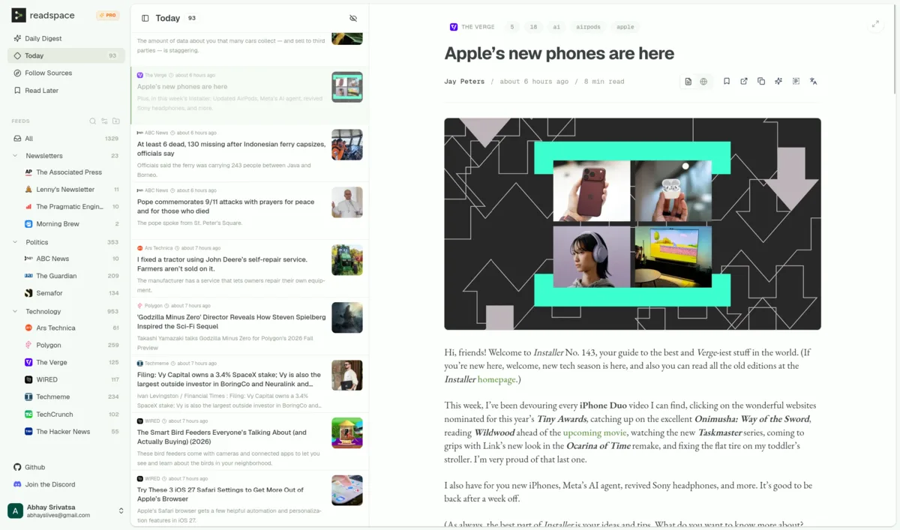
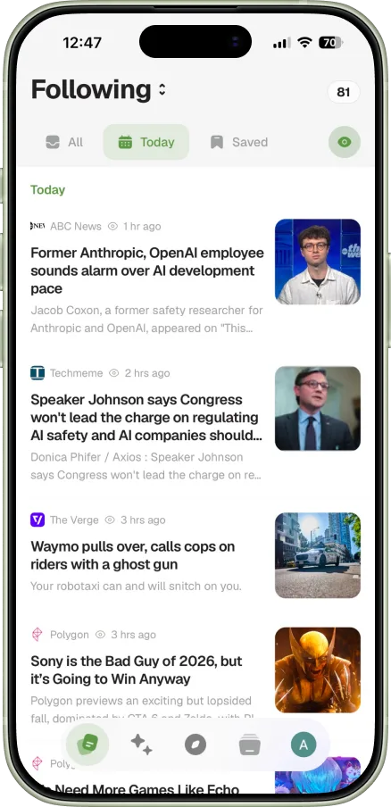
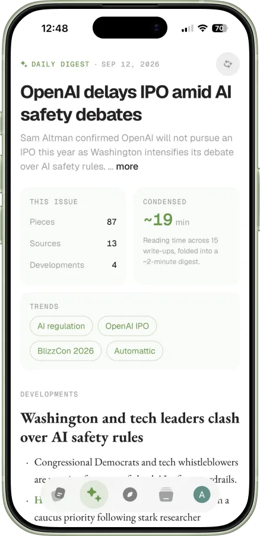

<div align="center">
  <a href="https://readspace.ai">
    
  </a>
</div>

<h1 align="center">An open-source reader for the web.</h1>

<p align="center">
  <strong>Bring the publications, newsletters, and independent voices you follow into one calm feed, with a five-minute digest for catching up.</strong>
</p>

<p align="center">
  <a href="https://app.readspace.ai">Hosted app</a>
  ·
  <a href="https://readspace.ai">Landing page</a>
  ·
  <a href="https://chromewebstore.google.com/detail/readspace/ppadpdoicnolpjnflfladjllhmkonedi">Chrome</a>
  ·
  <a href="https://addons.mozilla.org/en-us/firefox/addon/readspace/">Firefox</a>
</p>

<p align="center">
  <a href="https://github.com/kamui-fin/readspace/actions/workflows/ci.yml"></a>
  <a href="./LICENSE"></a>
  <a href="https://github.com/kamui-fin/readspace/stargazers"></a>
  <a href="https://discord.gg/2q5ptywuqz"></a>
</p>



<p align="center">
  
  &nbsp;&nbsp;&nbsp;&nbsp;
  
</p>

## About

Information consumption is broken. Algorithms dictate what you see, newsletters pile up unread, and the need to constantly check multiple sites leads to information overload and fatigue. You are missing what actually matters because platforms are designed to maximize engagement, not respect your attention.

Readspace is RSS-first. You choose the publications, blogs, writers, and communities you want to follow; Readspace fetches their RSS or Atom feeds and puts every new article into one chronological timeline. It does not reorder the feed for engagement or insert stories from sources you never followed.

But a complete feed is not always a manageable feed. The **daily digest** condenses recent articles from your subscriptions into a five-minute overview of the major developments and articles worth reading. It only uses sources you follow, and every item links back to the underlying material.

Readspace also brings saved webpages and extracted article content into the same library. The hosted service can receive email newsletters at a private `@readspace.ai` address. Your feeds and reading state sync across the web app, mobile clients, and browser extensions. The RSS reader is fully self-hostable, and its AI-backed features can be disabled.

**New to RSS?** RSS is an open format websites use to publish their latest posts. An RSS reader checks the feeds you subscribe to and collects new entries in one place without relying on a platform to decide what appears.

## Features

### Reading and organization

- Chronological RSS and Atom timeline with all, today, and unread views
- Folders, unread counts, and read/unread controls for articles, feeds, and folders
- Save feed articles to read later or archive any webpage from the browser extension
- Recently read history for finding articles you previously opened
- Full-article extraction when a feed provides only an excerpt
- Clean article reader with summaries, skim-mode highlights, and translations
- Light and dark themes across the web, mobile, and extension interfaces

### Sources and discovery

- Add a feed URL directly, paste a website, or detect its feed with the browser extension
- Search more than 120,000 feeds by topic on the hosted service
- View similar feeds to discover related sources
- Import and export subscriptions with OPML
- Follow sites without native feeds through RSSHub using `rsshub://` routes
- Receive newsletters at a private `@readspace.ai` address on the hosted service

### Catch up faster

- Turn the day's articles into a five-minute daily digest of what matters and what is worth reading
- Use summaries, skim mode, and translations when you want a faster way through an article
- Disable AI features entirely on a self-hosted instance

## Clients

- **Web:** Available at [app.readspace.ai](https://app.readspace.ai) or as part of a self-hosted deployment
- **Chrome:** [Install from the Chrome Web Store](https://chromewebstore.google.com/detail/readspace/ppadpdoicnolpjnflfladjllhmkonedi)
- **Firefox:** [Install from Firefox Add-ons](https://addons.mozilla.org/en-us/firefox/addon/readspace/)
- **iOS and Android:** Currently in closed beta testing and store review, with public releases expected within two weeks

The browser extensions and mobile clients can connect to a self-hosted Readspace instance using only its instance URL.

## Browser extensions

The extension supports two main workflows:

- Detect RSS or Atom feeds on the site you are visiting and follow them in one click.
- Save any page to read later, with an optional priority and note.


## Self-hosting

The Docker setup runs the web app, API, workers, Supabase, Redis, Meilisearch, and an optional RSSHub instance. Email newsletter ingestion is not currently available when self-hosting.

### Requirements

- Git
- Docker Engine or Docker Desktop with Docker Compose
- Bash, `curl`, `jq`, and OpenSSL

### Install

```bash
git clone https://github.com/kamui-fin/readspace.git
cd readspace

./docker/setup.sh
./docker/launch.sh
```

`setup.sh` configures the public URL, RSSHub, and optional AI support. `launch.sh` builds and starts the stack. Running setup again preserves existing secrets unless you explicitly rotate them.

Open [http://localhost:18042](http://localhost:18042) and create an account. To make it an administrator:

```bash
./docker/promote-admin.sh you@example.com
```

For a public deployment, follow the [reverse proxy examples](./docs/reverse-proxy-examples.md) for Caddy, Nginx, or Traefik.

### Connect an extension or mobile app to your instance

Open the extension or mobile app settings and enter your **instance URL**. This is the URL of the Readspace API, which usually ends in port `18008`:

```text
http://192.168.1.42:18008
```

That is the only value the client needs; Supabase configuration is discovered automatically. Use your public HTTPS API URL instead when running behind a reverse proxy.

<details>
<summary><strong>Reset or rotate secrets</strong></summary>

> [!CAUTION]
> Resetting permanently deletes all instance data.

```bash
./docker/reset.sh
./docker/launch.sh
```

To also regenerate secrets:

```bash
./docker/reset.sh
./docker/setup.sh --regenerate-secrets
./docker/launch.sh
```

</details>

## Development

Readspace is a monorepo containing several product surfaces and services:

| Path | What it contains |
| --- | --- |
| `apps/web` | Next.js web application |
| `apps/mobile` | Expo / React Native mobile application |
| `apps/extension` | Chrome and Firefox browser extension |
| `apps/inbound` | Hosted newsletter ingestion worker |
| `server` | FastAPI API, feed processing, and background jobs |
| `packages` | Shared code, configuration, and design tokens |
| `docker` | Self-hosted infrastructure and setup scripts |

For prerequisites, local infrastructure, app-specific commands, database migrations, tests, and pull-request guidance, see [CONTRIBUTING.md](./CONTRIBUTING.md).

## Contributing

Bug fixes, documentation improvements, feature work, and thoughtful product feedback are all welcome.

1. Read the [contributing guide](./CONTRIBUTING.md).
2. Check [existing issues](https://github.com/kamui-fin/readspace/issues) before opening a new one.
3. For ideas or questions that are not yet actionable bugs, start a [GitHub discussion](https://github.com/kamui-fin/readspace/discussions).

## Community

- [Join the Discord](https://discord.gg/2q5ptywuqz)
- [Start a discussion](https://github.com/kamui-fin/readspace/discussions)

## License

Readspace is licensed under the [GNU Affero General Public License v3.0](./LICENSE).
