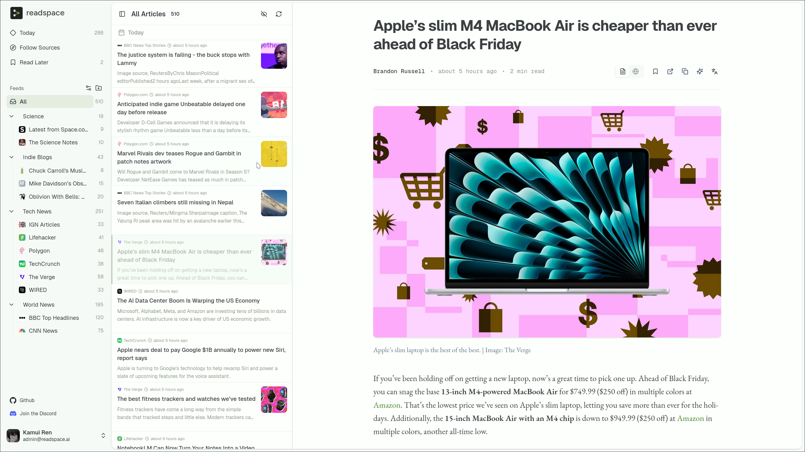
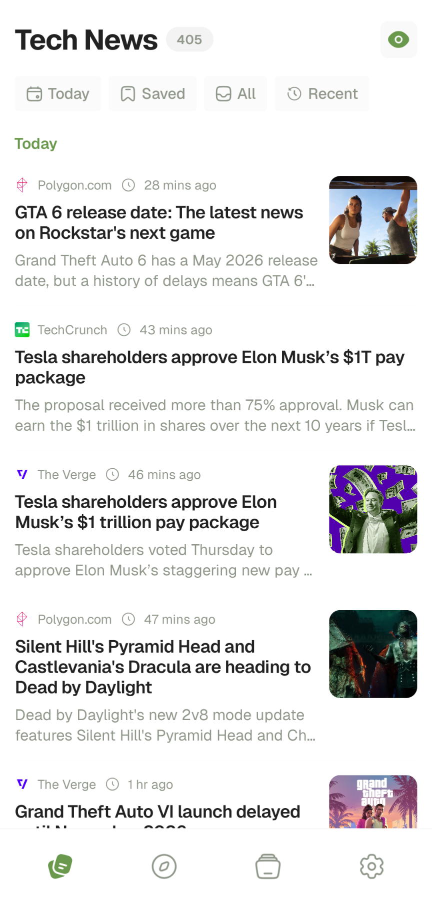
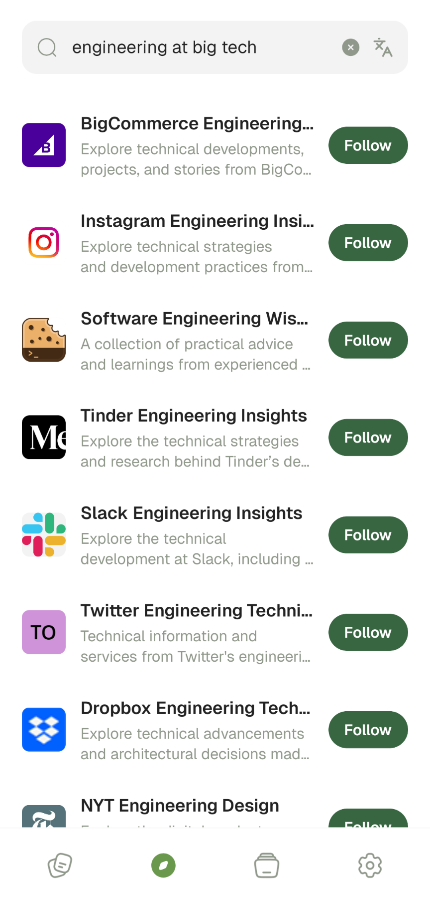
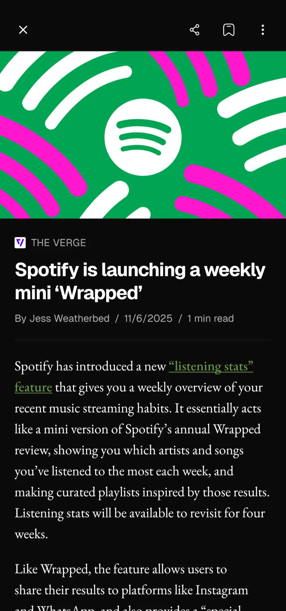
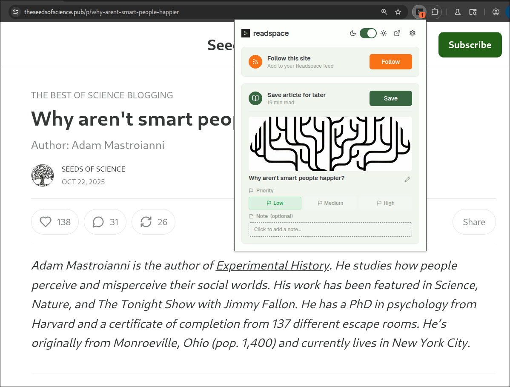

<div align="center">
  
</div>

# Readspace


A privacy-focused open-source RSS reader to follow all the blogs, publications, newsletters, and writers you care about.

All in one distraction-free inbox. No algorithms, no ads, no tracking.



<div>
  
  
  
</div>


## Features

- Open source, Easy self-hosting, Privacy-friendly
- Hosted version at app.readspace.ai
- Firefox / Chrome extensions
    - Save article to Readspace to read later
    - Detect and follow feeds directly on any site
- Web, iOS, Android
    - Smart search engine with over 10,000 feeds
    - View similar feeds
    - Read the original articles
    - Summaries, translations
    - Folder-based organization
    - RSSHub support
    - OPML import / export
    - Dark mode
    - Beautiful UI/UX & minimalist reader
- ... and much more coming!

## Motivation

Information consumption is broken. Algorithms dictate what you see, newsletters pile up unread, and the need to constantly check multiple sites leads to information overload and fatigue. You are missing what actually matters because platforms are designed to maximize engagement, not respect your attention.

The abrupt shutdown of Google Reader fractured the original user-controlled web reading experience. Its commercial successors, like Feedly, have since prioritized high-value enterprise AI solutions (threat intelligence, market research), effectively abandoning the core consumer mission of a simple, focused reader.

**Readspace reclaims this legacy.** 

We are building the best way to stay informed by leveraging the power of RSS, giving you a focused, ad-free, chronological stream from your chosen sources.

## Getting Started

The hosted version is available at [app.readspace.ai](https://app.readspace.ai).

### Browser Extension

Save what you find, follow what you love.

The Readspace browser extension makes it effortless to capture articles as you browse. With one click, you can save any page to your Readspace “Read Later” list, just like Pocket—perfect for all those tabs you promise to get back to.

It also includes a built-in RSS radar that automatically detects feeds on any website (even the ones that try to hide them). When you find a site worth following, just click once to subscribe directly from the browser.

- Firefox: [Get it on Add-ons →](https://addons.mozilla.org/en-US/firefox/addon/readspace/)
- Chrome: Coming soon



### Self-Hosting

Readspace is designed for easy self-hosting, giving you complete control over your data and experience.

#### Prerequisites

* **Git**: For cloning the repository.
* **Docker**: Ensure Docker Desktop or Docker Engine is installed and running (v20 or higher recommended).
* **jq**: Command-line JSON processor used by setup scripts.

#### Steps 

1.  **Clone the Repository**

    ```bash
    git clone https://github.com/kamui-fin/readspace.git
    cd readspace/docker
    ```

2.  **Configure `.env` files**

    ```bash
    ./setup.sh
    ```

3.  **Launch services**

    ```bash
    ./launch.sh
    ```

4.  **Create your account**

    Visit `localhost:18042` and sign up for a new account.

5.  **Promote to admin** (Optional)

    Grant admin privileges to your account:

    ```bash
    ./promote-admin.sh your-email@example.com
    ```

6.  **Configure Browser Extension** (Optional)

    To connect the browser extension to your self-hosted instance, configure:
    - **Server URL**: `http://your-ip-or-domain:18042`
    - **Supabase URL**: `http://your-ip-or-domain:18000`
    - **Supabase Anon Key**: `grep NEXT_PUBLIC_SUPABASE_ANON_KEY apps/web/.env`

#### Using a Custom Domain

If you want to access Readspace via your own domain (e.g., `https://app.example.com`):

1. Run `./setup.sh` and select option 2 (Custom domain)
2. Configure your reverse proxy (Traefik, nginx, Caddy, etc.)
3. See [docs/reverse-proxy-examples.md](docs/reverse-proxy-examples.md) for detailed configuration examples

## Contributing

Readspace is built by the community and we welcome contributions of all kinds, from bug fixes to new features.

To get started, please check out our **[Contributing Guide](CONTRIBUTING.md)**.

## Community & Roadmap

We're building Readspace transparently and collaboratively. Join our growing community and help shape the future of focused reading:

* **Discord:** [Join our community here](https://discord.gg/2Q5PtYwUQZ)
* **GitHub:** Star us and help shape the product.